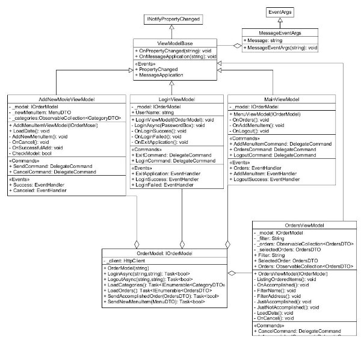

B1V655 Webes alkalmazások fejlesztése 2. beadandó 3

Horváth Milán 2.Beadandó/4.Feladat 2019. november 8.

B1V655

1. Feladatleírás

Az asztali grakus felületet az alkalmazottak használják a rendelések, illetve a weblap tartalmának adminisztrálá- sára.

- Az alkalmazott bejelentkezhet (felhasználónév és jelszó megadásával) a programba, illetve kijelentkezhet.
- Bejelentkezve listázódnak a leadott, illetve teljesített rendeléseket (leadás id®pontja, teljesítés id®pontja, név, cím, telefonszám, összeg), egy rendelést kiválasztva pedig listázódnak a tételeket. A leadott rendelés teljesítettnek jelölhet®, ekkor a rendszer rögzíti a teljesítés id®pontját is. A lista sz¶rhet® csak teljesített, illetve csak leadott rendelésekre, továbbá a rendel® nevére, illetve cím(részlet)re.
- Lehet®ség van új étel, illetve ital hozzáadására (név, ár, illetve étel esetén leírás, csíp®s/vegetáriánus tulaj- donságok megadásával). Az egyértelm¶ség miatt nem engedélyezett több ugyanolyan nev¶ étel/ital felvitele.

Az adatbázis az alábbi adatokat tárolja:

- kategóriák (név);
- ételek és italok (név, kategória, leírás, ár, csíp®s-e, vegetáriánus-e);
- munkatársak (teljes név, felhasználónév, jelszó);
- rendelések (név, cím, telefonszám, megrendelt ételek és italok, teljesített-e).
2. Elemzés
- Az alkalmazás perzisztencia részét egy küls® C# könyvtárként kezeljük. A weblap részt MVC segítségével hozzuk létre. A grakus felületet WPF-el MVVM architektúrában megvalósítva.
- Több ablakra is szükségünk van:
  - Bejelentkez® felület
  - Egy menüablak, ahol kiválaszthatjuk melyik funkciót szeretnénk használni
  - Rendelések listázására szolgáló ablak.
  - Új étel felvételére szolgáló ablak.
- Az alkalmazáshoz szükséges egy adatbázis is. A feladatban leírt adatbázis jól megfogalmazható SQL adatbá- zisként.

1\. ábra. Felhasználói esetdiagram

3\. Tervezés

1. Programszerkezet

Programszerkezet

- A programot MVVM architektúrával valósítjuk meg.
- A feladathoz a programot két projektre osztjuk. Egy a Order.Persistence, mely az adatbázisát és a WebAPI- nak átadott típusait kezeli.
- A másik projekt az Order.WPF felel®s az app futtatásáért, illetve a funkcióiért. Itt találhatóak a View- ViewModel párok, melyekkel megvalósítjuk a különböz® oldalakat.

2. ábra. A WPF app és a perzisztencia szerkezete
2. Perzisztencia

3. ábra. Az adatbázis kapcsolatok, és táblák
3. WPF alkalmazás
- WPF alkalmazás MVVM architektúrában megvalósítva
- Model, mely a szerver oldali hívásokat végzi
- Szükséges nézetek:
  - Login - Bejelentkezés
  - Menu - F®menü
  - AddNewMenuItem - Új étel felvétele az étlapra
  - Orders - A megrendelések listázása, azok lezárása
- Minden nézethez tartozik egy ViewModel
4. WebAPI
- api/Account/{username}/{password}: HttpGet - Bejelentkezés
- api/Account/Logout: HttpGet - Kijelentkezés
- api/Menu HttpPost - Új étel felvétele a Menüre
- api/Category/CategoryList HttpGet - A kategóriák listázásához szükséges lekérés
- api/Orders/OrdersList HttpGet - A megrendelések listázásához szükséges lekérés
- api/Orders

  HttpPost - Megrendelés készre jelentése.

B1V655 Webes alkalmazások fejlesztése 1. beadandó 4

4. ábra. WPF alkalmazás osztálydiagramja

4\. Tesztelés

A webszolgáltatás tesztelése Unit teszteken keresztül történt, egy memóriában létrehozott adatbázis használatával.

- GetOrdersTest: Megrendelések lekérdezése.
- GetCategoryTest: Kategóriák lekérdezése.
- AddNewMenuItem: Új étel hozzáadásának tesztelése.
- IsAccompliched: Készre jelentés tesztelése.
